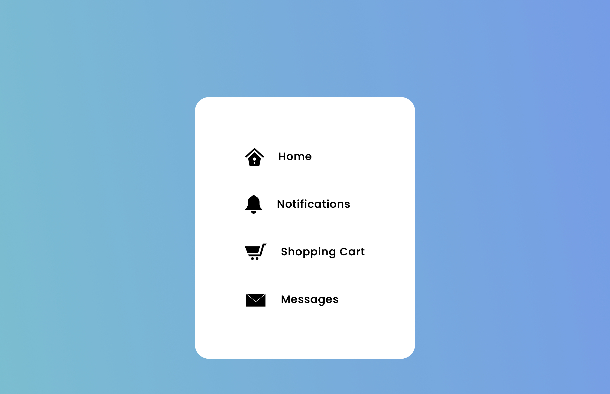
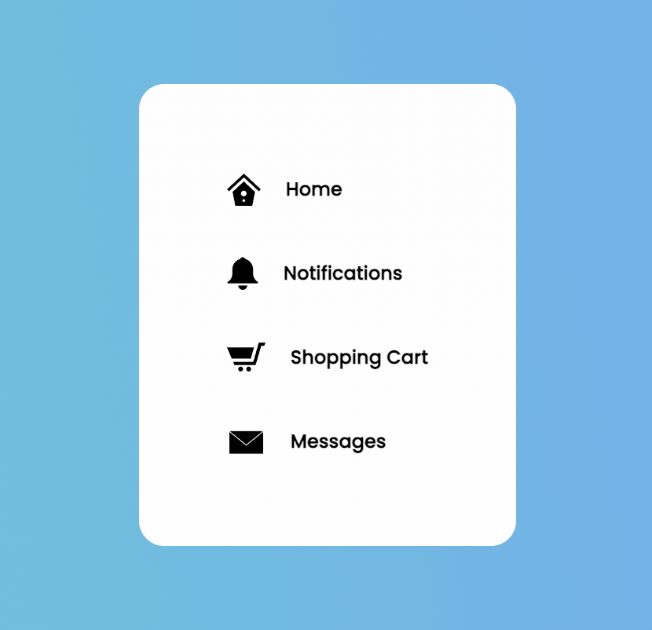

# Micro Animations

A animated navigation link using the GSAP js library

https://juniordugue.github.io/Micro-Animations/

---

## Tech Stack

**Frontend:** HTML, CSS, GSAP & JS

---

## Screenshots

---

## Demo

---

## Lessons Learned

Learned about GSAP set methods and how to set a CSS property one way, before initiating the animation to the CSS property to go another way, learn about the fromto and to methods which can be used as a starting point or ending point of animation transition.

---

## Feedback

If you have any feedback, please reach out to me at jrdugue@gmail.com

---